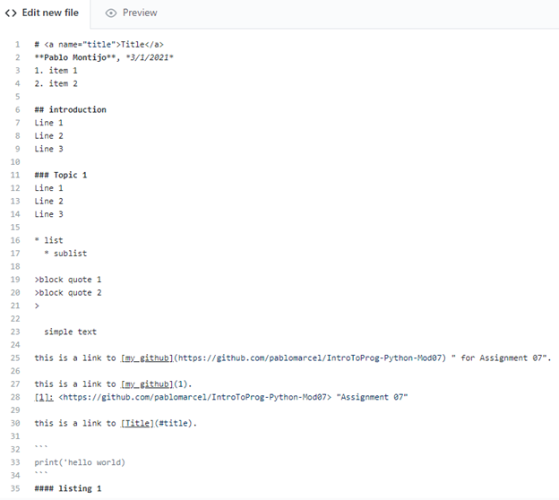

# <a name="title">Title</a>
**Pablo Montijo**, *3/1/2021*
1. item 1
2. item 2

## introduction
Line 1
Line 2
Line 3

### Topic 1
Line 1
Line 2
Line 3

* list
  * sublist

>block quote 1
>block quote 2
>

  simple text

this is a link to [my github](https://github.com/pablomarcel/IntroToProg-Python-Mod07) " for Assignment 07".

this is a link to [my github](1).
[1]: <https://github.com/pablomarcel/IntroToProg-Python-Mod07> "Assignment 07"

this is a link to [Title](#title).

```
print('hello world)
```
#### listing 1



#### Figure 1. The Markdown Code
