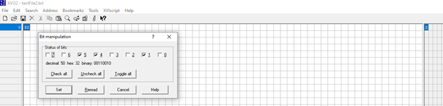

 Pablo Montijo

 3/1/2021

 Foundations of Programming: Python

 Assignment7

[github link](https://github.com/pablomarcel/IntroToProg-Python-Mod07) "for Assignment 07"

# Introduction

 In this document I review the uses and benefits of custom exception handling, binary file manipulation and the difference between binary and text files. Github webpages are    briefly discussed and a glimpse of the Markdown language is presented. At the end, a python script is presented to illustrate the pickle module in python and the functionality  of try-except blocks. 

**What are the benefits of putting built-in Python command into functions?**

 One of the benefits of using a function is flexibility. By using a function multiple built-in python commands can be used and the docstring can be updated with information  about parameters and return values as applicable to those built-in functions (Root, R. Programming with Python, Module 07 Notes, page 2). The function allows for customization and code simplification at the same time. An example is shown in figure 1.
 

#### Figure 1. Shows built in python commands within a function

**What are the benefits of using structured error handling?**

 Adding custom error handling to the python script aids in taking full control of the code as opposed to let python handle it. When python finds an exception at run time, the  program halts. The benefit of adding error handling is preventing the program from ending abruptly and informing the user that an exception has happened but in a controlled way (Dawson, M. Python Programming for Absolute Beginners, Cengage, 2010, page 205).  These are some of the exception types that can be used: IOError, IndexError, KeyError, NameError, SyntaxError, TypeError, ValueError, ZeroDivisionError (Dawson, M. Python Programming for Absolute Beginners, Cengage, 2010, page 207). An example is shown in figure 2. I created three custom exception classes based off the ‘Exception’ class. The string method is overridden to display targeted messages.


#### Figure 2. Shows custom exception classes

**How is the Exception class used?**

 Python can create an exception object whenever an error occurs. Having an object available allows for making inquiries about the object properties such as its ‘docstring’, its string representation, or the error type (Root, R. Programming with Python, Module 07 Notes, page 16). 

**How do you "derive" a new class from the Exception class?**

 The exception class can be treated as any other class in python. To use a custom exception class, the exception class is added as the base class in the custom class following the principles of inheritance. Next, the exception class methods, such as ‘__str__’ can be overridden with a custom message (Root, R. Programming with Python, Module 07 Notes, page 18). An example is shown in figure 2. The base class is included inside the parenthesis, and the methods are overridden.

**When might you create a class derived from the Exception class?**

 When the design intent of the built-in exception class is close to the requirements of the code but there is a need for tweaks such as fine tuning the message displayed to the user whenever an error occurs, i.e., modifying the ‘__str__’ method of the base class. In the python script for this activity, there is a need to send a targeted message to the user whenever the wrong type of data is entered.

**What is the Markdown language?**

 Is a markup language that allows creating text documents with annotations that specify how the document is to be formatted (Mailund, Thomas. Introducing Markdown and Pandoc. Apress, 2019, page 1). 

**How do you use Markdown on a GitHub webpage?**

To use Markdown, a certain syntax must be followed (Mailund, Thomas. Introducing Markdown and Pandoc. Apress, 2019, page 14-20):
```
#

 level 1 headers

##

 level 2 headers

###

 level 3 headers

"*"

 unnumbered list

Tab + *

 unnumbered sub-list

**word**

 bold face

*word*

 italics

"1."

 list item number 1

">"

 block quote

Tab

 simple text

[my github](https://github.com/pablomarcel/IntroToProg-Python-Mod07)

 Interweb links

# <a name="some_label">Some_Section</a>

 Adds a label to a section so it can be referenced as a link

[Some_Section](#some_label)

 calls a section which has been declared with a label

"```"

 Used to present code

####

 Used to add code listings.

```
#### Figure 3. Shows a partial list of the Markdown language


#### Figure 4. Shows an example of formatted text

 The answer on how to work with links to sections within the document was obtained [here](https://gist.github.com/asabaylus/3071099)

**What are the differences between a text file and a binary file?**

 A text file can be interpreted as composed of a sequence of characters, in which each character is composed of one byte (8 bits). A hex editor like XVI32 can be used to illustrate the concept. In this example, a simple text file was created in notepad and filled with words ‘Text File’. The first character, ‘2’, is represented by the hex value ‘32’ which in turn is represented by binary value ‘00110010’. The hex editor is available at [xvi32](http://www.chmaas.handshake.de/delphi/freeware/xvi32/xvi32.htm#download)


#### Figure 5. Shows character ‘2’, as a ‘50’ in decimal, ’32’ in hex and ‘00110010’ in binary 

 Figure 5 Shows character ‘2’, as a ‘50’ in decimal, ’32’ in hex and ‘00110010’ in binary 
Binary files, on the other hand, are composed of more complex data but can be interpreted as a stream of bytes (Deitel, P, Deitel, H. Intro to Python for Computer Science and Data Science. Pearson, 2020, page 321). Other way to put it is to say that binary files store a sequence of objects, for example, dictionaries, lists or tables (Dawson, M. Python Programming for Absolute Beginners, Cengage, 2010, page 201). 

A database can be used as an example of binary file. In this case, I used database ‘chinook’ available at the link below.  This database stores 11 tables and data. Figure 6 the contents of the binary file as seen in the hex editor. Figure 6 shows a particular address that stores number 2 as data, link [here](https://www.sqlitetutorial.net/sqlite-sample-database/)


#### Figure 6. Shows number ‘2’ as ‘2’ in decimal, ‘02’ in hex, and ‘00000010’ in binary 

 It is interesting to note that numbers are captured as numbers in binary files and not as text. Two as character is ‘50’ in decimal, ’32’ in hex, and ‘00110010’ in binary. But two as a number is ‘2’ in decimal, ‘02’ in hex, and ‘00000010’ in binary per figure 6.

# Python Script

 In this python script, I ask the user to input a student ID, Name and Grade, and then store it in a binary file. Custom exception classes are generated to send targeted  messages to the user whenever there is a type error.

### Main Body.
 The main code handles the while loop and handles the user choices. Option 1 directs the user to input data. Option 2 prints the data to screen. Option 3 saves to file. Option 4 exits.
 

#### Figure 7. Shows the Main Body

### Input Output.
 This section handles the user input and incorporates the try-except blocks to catch type errors. A partial listing of class IO is shown in figure 8. 


#### Figure 8. Shows one of the methods in the IO Class

### Processing.
 This section handles the binary file manipulations with the help of two methods. The code is in figure 9.


#### Figure 9. Shows the processing of data

### Error Handling.
 This section handles the custom exception classes. Class ‘NameIsNumericError’ comes alive whenever a user enters numbers when asked for a name. Class ‘IDisNotIntError’ catches a type error and overrides the string method to tell the user the Student ID must be an Integer.


#### Figure 10. Shows custom exception classes

 Figure 11 shows the custom exception class in action. In this test, I entered number 0 for a student name, and the error was triggered and the custom message was printed ‘A Name Cannot be Numeric’.


#### Figure 11. Shows custom esception class NameIsNumericError

# Console Test.

 The console test shows the code is behaving as expected per the summary below.
 The user selects option 2 ‘Print Data’ and the existing data is shown.
 The user selects option 1 ‘Add student’ and new data is entered.
 The user selects option 2 again but since no data was written to file, the old data is shown.
 The user selects option 3 ‘Save Data to File’ and the data is written.
 The user selects option 2 and the new data is shown.

```
python Assignment07.py

        Menu of Options
        1) Add a student
        2) Print Data
        3) Save Data to File
        4) Exit Program


Which option would you like to perform? [1 to 4] - 2

{'ID': 1, 'Name': 'Joe', 'Grade': 55.0}

        Menu of Options
        1) Add a student
        2) Print Data
        3) Save Data to File
        4) Exit Program


Which option would you like to perform? [1 to 4] - 1

enter an ID: 2
enter an Student Name: Mike
enter a numeric Grade: 99

        Menu of Options
        1) Add a student
        2) Print Data
        3) Save Data to File
        4) Exit Program


Which option would you like to perform? [1 to 4] - 2

{'ID': 1, 'Name': 'Joe', 'Grade': 55.0}

        Menu of Options
        1) Add a student
        2) Print Data
        3) Save Data to File
        4) Exit Program


Which option would you like to perform? [1 to 4] - 3

Save this data to file? (y/n) - y

Press the [Enter] key to continue.

        Menu of Options
        1) Add a student
        2) Print Data
        3) Save Data to File
        4) Exit Program


Which option would you like to perform? [1 to 4] - 2

{'ID': 2, 'Name': 'Mike', 'Grade': 99.0}

        Menu of Options
        1) Add a student
        2) Print Data
        3) Save Data to File
        4) Exit Program


Which option would you like to perform? [1 to 4] - 4

Goodbye!
```
#### Figure 12. Shows the test in the console

# The Code

```
# ------------------------------------------------- #
# Title: Assigment 07
# Description: Working with binary files, the pickle module and exception handling.
#               The program ask the user for student ID, Name and Grades, stores it in a dictionary row
#               and saves it to a binary file using the pickle module. Also, there is an option for printing
#               the content of the binary file to screen. Custom Error Handling is introduced to catch type errors.
#
# ChangeLog: (Who, When, What)
# Pablo Montijo, 3/2/2021,Created Script
# -------------------------------------------------
# import pickle # This imports code from another code file!,
# import sys

import pickle
import sys

# Data ---------------------------------------------------------------------- #
# Declare variables and constants

id_int = "" # Student ID
name_str = ""   # Student Name
grade_flt = ""  # Student Grade
row_lst = []    # A row that captures ID, Name and Grade
dic_row = {}    # A dictionary row that captures ID, Name and Grade
objFile = None   # An object that represents a file
strFileName = 'grades.dat'  # A binary file with the dictionary object
lstStudent = [] # a list of Student
lstTable=[]
strStatus = ""

# Custom Error Handling

class NameIsNumericError(Exception):    # Custom class to catch Names that include numbers
    def __str__(self):
        return 'A Name Cannot be Numeric'

class IDisNotIntError(Exception):       # Custom class to catch non integer values for Student ID's
    def __str__(self):
        return 'An ID has to be an Integer'
class CustomError(Exception):           # Custom class to catch a generic type exception
    def __str__(self):
        return 'Custom Error'

# Processing -------------------------------------- #

def save_data_to_file(file_name, list_of_data):
    """ Saves data to a binary file into a dictionary row

    :param file_name: (string) with name of file:
    :param list_of_data: (list) you want filled with file data:
    :return: none
    """
    pass # TODO: Add code here
    objFile = open(file_name,'wb')
    pickle.dump(list_of_data, objFile)
    objFile.close()

def read_data_from_file(file_name):
    """ Reads data from binary file

    :param file_name: (string) with name of file:
    :return: the dictionary row with student info
    """
    pass # TODO: Add code here
    objFile = open(file_name, 'rb')
    objFileData = pickle.load(objFile)
    objFile.close()
    return objFileData

# Presentation ------------------------------------ #

class IO:
    """ Performs Input and Output tasks """

    @staticmethod
    def print_menu_Tasks():
        """  Display a menu of choices to the user

        :return: nothing
        """
        print('''
        Menu of Options
        1) Add a student
        2) Print Data
        3) Save Data to File        
        4) Exit Program
        ''')
        print()  # Add an extra line for looks

    @staticmethod
    def input_menu_choice():
        """ Gets the menu choice from a user

        :return: string
        """
        choice = str(input("Which option would you like to perform? [1 to 4] - ")).strip()
        print()  # Add an extra line for looks
        return choice

    @staticmethod
    def input_yes_no_choice(message):
        """ Gets a yes or no choice from the user

        :return: string
        """
        return str(input(message)).strip().lower()

    @staticmethod
    def input_press_to_continue(optional_message=''):
        """ Pause program and show a message before continuing

        :param optional_message:  An optional message you want to display
        :return: nothing
        """
        print(optional_message)
        input('Press the [Enter] key to continue.')

    @staticmethod
    def input_new_id_student_and_grade():
        """ Pause program and show a message before continuing

        :return: the student ID, Name and Grade
        """
        pass  # TODO: Add Code Here!
        try:
            id_int = int(input('enter an ID: '))
        except ValueError as e:
            print(e, e.__doc__, type(e), sep='\n')
            sys.exit()

        try:
            name_str = input('enter an Student Name: ')

            if name_str.isnumeric():
                raise NameIsNumericError()

        except Exception as e:
            print(e, e.__doc__, type(e), sep='\n')
            sys.exit()
        try:
            grade_flt = float(input('enter a numeric Grade: '))

        except ValueError as e:
            print(e, e.__doc__, type(e), sep='\n')
            sys.exit()

        return id_int, name_str, grade_flt

# Main Body ------------------------------------ #

while(True):

    IO.print_menu_Tasks()  # Shows menu
    # menu printed
    strChoice = IO.input_menu_choice()  # Get menu option
    # choice returned

    if strChoice.strip() == '1':  # Add a new Task
        # TODO: Add Code Here
        id_int, name_str, grade_flt = IO.input_new_id_student_and_grade()
        row_lst = [id_int, name_str, grade_flt]
        dic_row = {"ID": id_int, "Name": name_str, "Grade": grade_flt}
        continue  # to show the menu

    elif strChoice == '2':  # Print Data
        # TODO: Add Code Here
        returned_data = read_data_from_file('grades.dat')
        print(returned_data)
        continue  # to show the menu

    elif strChoice == '3':   # Save Data to File
        strChoice = IO.input_yes_no_choice("Save this data to file? (y/n) - ")
        if strChoice.lower() == "y":
            # TODO: Add Code Here!
            IO.input_press_to_continue(strStatus)
            save_data_to_file('grades.dat', dic_row)
        else:
            IO.input_press_to_continue("Save Cancelled!")
        continue  # to show the menu

    elif strChoice == '4':  # Exit Program
        print("Goodbye!")
        break   # and Exit

```
#### Figure 13. Shows Assignment07.py

# Summary

 In this activity the differences between text and binary files were reviewed. Binary files turn out to be more flexible because they can handle any object such as lists, tables, databases, and dictionaries in contrast to text files which can only handle characters. The python script used in this activity handles a binary file that stores a dictionary object. Also, this document reviews the error handling process in python which comes handy in providing feedback to the user whenever errors arise. As a side activity, markdown syntax is explored to help in creating Github webpages. The Markdown language turned out to be straightforward and easy to use. 
